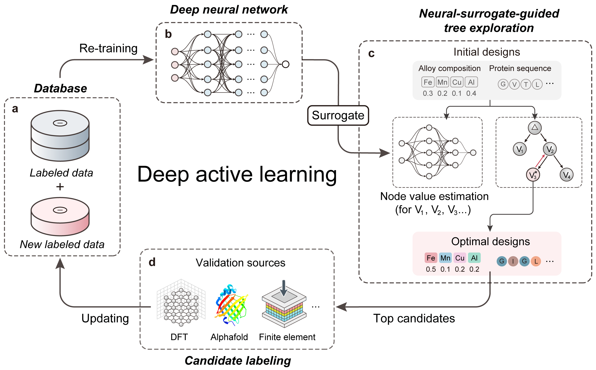

# DANTE: Deep Active learning with Neural-surrogate-guided Tree Exploration

## Introduction

DANTE is a deep active learning pipeline that combines deep neural surrogate models and a novel tree search explorationalgorithm to find superior solutions in high-dimensional complex problems characterized by limited data availability. 

For more details, please refer to our [paper](https://arxiv.org/abs/2404.04062).

<p align="center">
  
</p>

## Installation

DANTE requires `python>=3.10`. Installation of TensorFlow and Keras with CUDA support is strongly recommended.

To install DANTE, run:

```bash
pip install git+https://github.com/Bop2000/DANTE.git
```

Alternatively, you can clone the repository and install it locally:

```bash
git clone git@github.com:Bop2000/DANTE.git
cd DANTE
pip install -e .
```

## Running Tests

To run tests for DANTE, execute the following command in the project root directory:

```bash
python -m pytest -m "not slow"
```

## Sample Code

Here's a minimal example of how to use DANTE:

```python
import numpy as np
from dante.obj_functions import Ackley
from dante.neural_surrogate import AckleySurrogateModel
from dante.tree_exploration import TreeExploration
from dante.utils import generate_initial_samples

# Define parameters
NUM_DIMENSIONS = 20
NUM_INITIAL_SAMPLES = 100
NUM_ACQUISITIONS = 30
SAMPLES_PER_ACQUISITION = 20

# Initialise the objective function and surrogate model
obj_function = Ackley(dims=NUM_DIMENSIONS)
surrogate = AckleySurrogateModel(input_dims=NUM_DIMENSIONS, epochs=500)

# Generate initial samples
input_x, input_y = generate_initial_samples(
    obj_function, num_init_samples=NUM_INITIAL_SAMPLES, apply_scaling=True
)

# Main optimisation loop
for i in range(NUM_ACQUISITIONS):
    # Train surrogate model and create tree explorer
    trained_surrogate = surrogate(input_x, input_y)
    tree_explorer = TreeExploration(func=obj_function, model=trained_surrogate, num_samples_per_acquisition=SAMPLES_PER_ACQUISITION)
    
    # Perform tree exploration to find promising samples
    new_x = tree_explorer.rollout(input_x, input_y, iteration=i)
    new_y = np.array([obj_function(x, apply_scaling=True) for x in new_x])
    
    # Update dataset with new samples
    input_x = np.concatenate((input_x, new_x), axis=0)
    input_y = np.concatenate((input_y, new_y))
    print(f'number of data is {len(input_y)}')
    print(f'current best y value is {input_y.max()}')
    
    # Check for convergence
    if np.isclose(input_y.max(), 9999.0):
        print(f"Optimal solution found after {i+1} iterations.")
        break

# Print results
best_index = np.argmin(input_y)
print(f"Best solution: {input_x[best_index]}")
print(f"Best objective value: {obj_function(input_x[best_index], apply_scaling=False)}")
```

## How to use DANTE to optimise your own function?

To incorporate your own function into DANTE, please encapsulate it within a class as demonstrated below. You can find several examples in the [obj_functions.py](dante/obj_functions.py) file for reference.

```python
@dataclass
class myFunction(ObjectiveFunction):
    dims: int = 10
    turn: float = 0.1
    name: str = "my_function"

    def __post_init__(self):
        self.lb = -5 * np.ones(self.dims) # Define the lower bounds for each dimension of the problem
        self.ub = 5 * np.ones(self.dims)  # Define the upper bounds for each dimension of the problem
        self.tracker = Tracker("my_function")  # Initialise a tracker to monitor the function's performance

    def scaled(self, y: float) -> float:  # Define a scaling function for better surrogate training
        return 100 / (y + 0.01)

    def __call__(self, x: np.ndarray, apply_scaling: bool = True) -> float:
        x = self._preprocess(x)
        y = some_function(x) # Define your function here
        return y if not apply_scaling else self.scaled(y)
```

## License

The source code is released under the MIT license, as presented in [here](LICENSE).
